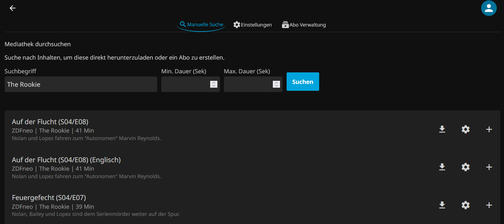
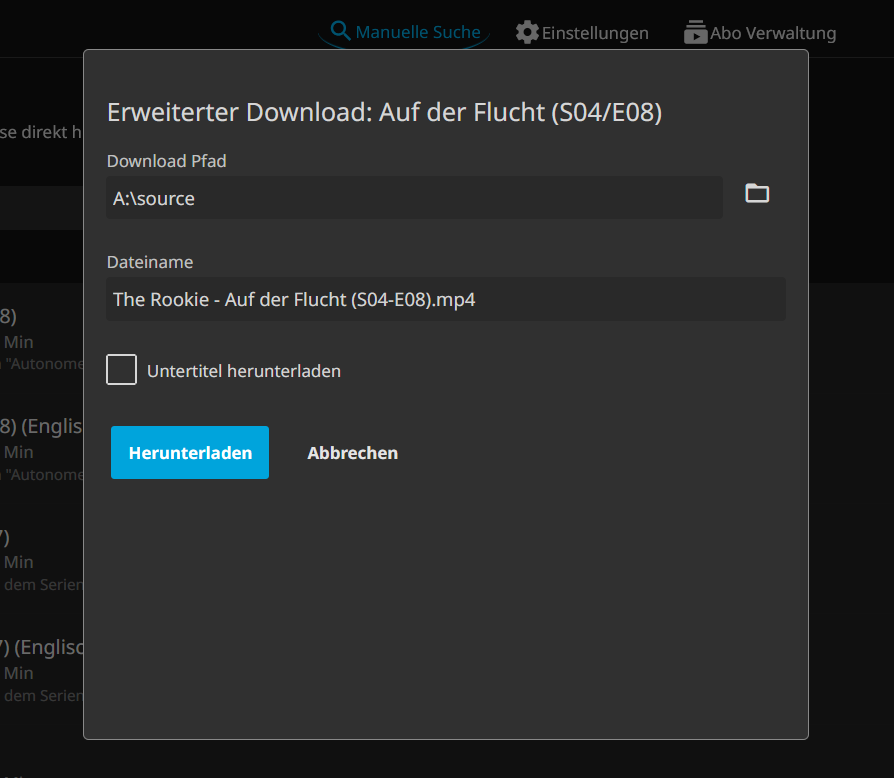
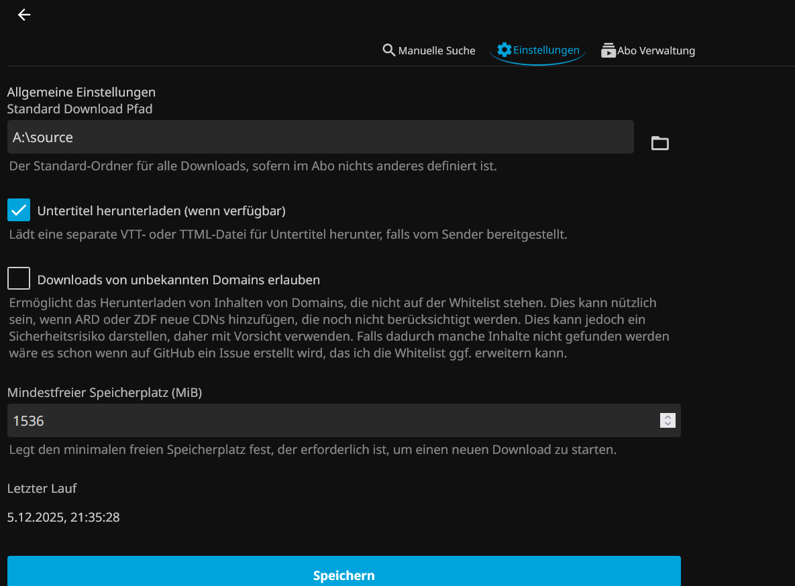
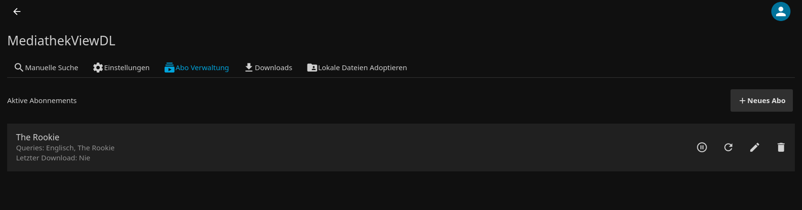
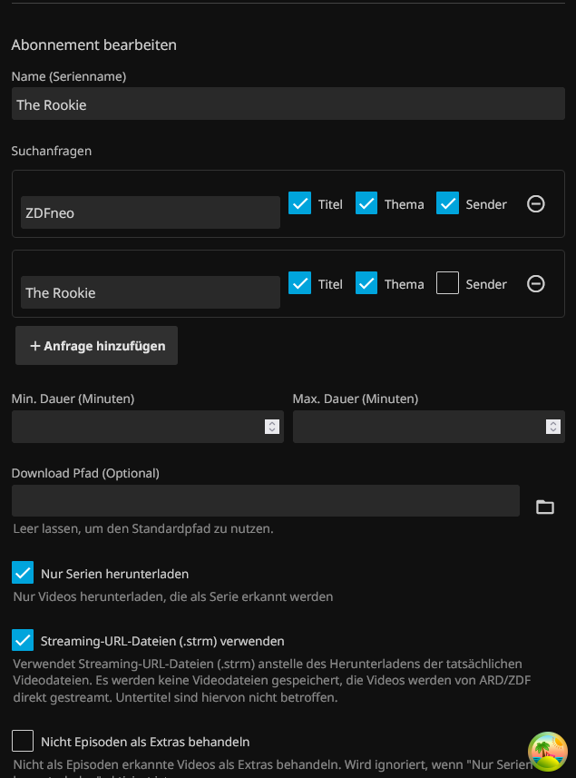
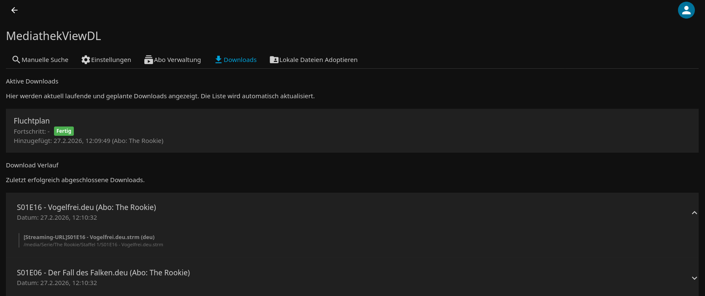
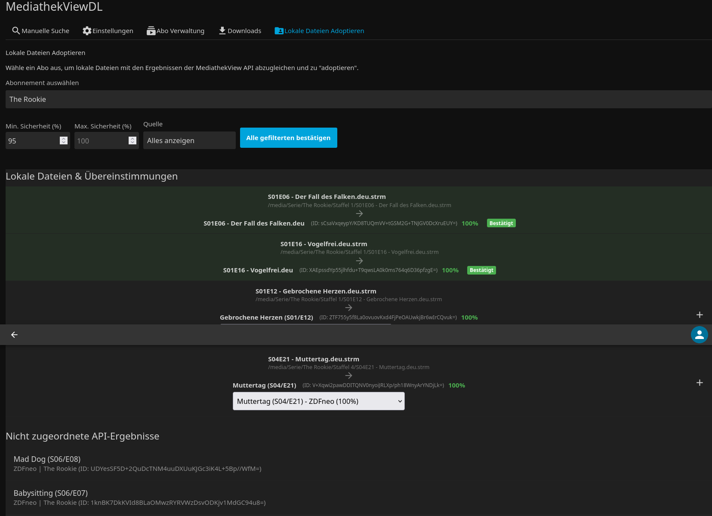

# 📺 Jellyfin MediathekViewDL Plugin

**Ein leistungsstarkes Jellyfin-Plugin zum Suchen und Herunterladen von Inhalten aus den öffentlich-rechtlichen Mediatheken (ARD, ZDF, etc.).**

Dieses Plugin integriert die [MediathekViewWeb-API](https://mediathekviewweb.de/) direkt in Jellyfin. Es ermöglicht das automatische Abonnieren von Sendungen, das intelligente Verwalten von Downloads und die nahtlose Integration in Ihre Medienbibliothek.

---

## 📑 Inhalt

*   [✨ Features](#-features)
*   [🚀 Installation](#-installation)
*   [⚙️ Konfiguration & Nutzung](#-konfiguration--nutzung)
    *   [Manuelle Suche](#-manuelle-suche)
    *   [Allgemeine Einstellungen](#-allgemeine-einstellungen)
    *   [Abonnements (Automatische Downloads)](#-abonnements-automatische-downloads)
    *   [Downloads](#-downloads)
    *   [Datei-Adoption (Manuelle Zuordnung)](#-datei-adoption-manuelle-zuordnung)
*   [🧠 Funktionsweise](#-funktionsweise)
*   [❤️ Danksagung & Disclaimer](#-danksagung--disclaimer)

---

## ✨ Features

| Bereich | Funktionen |
| :--- | :--- |
| **🔎 Suche & Abos** | • **Automatische Downloads:** Neue Episoden Ihrer Lieblingssendungen werden sofort geladen.<br>• **Manuelle Suche:** Durchsuchen Sie die gesamte Mediathek direkt in Jellyfin.<br>• **Smart Filters:** Filtern nach Thema, Sender oder Titel. |
| **💾 Download-Manager** | • **Zentrale Übersicht:** Neuer Tab für aktive Downloads, Historie und Warteschlange.<br>• **Kontrolle:** Downloads pausieren, abbrechen oder priorisieren.<br>• **Duplikat-Schutz:** Eine lokale Datenbank verhindert doppelte Downloads. |
| **💎 Qualität** | • **Auto-Upgrade:** Ersetzt Dateien automatisch durch bessere Versionen (z.B. SD -> HD).<br>• **Smart Fallback:** Weicht auf niedrigere Qualitäten aus, wenn HD nicht verfügbar ist.<br>• **Untertitel:** Lädt Untertitel automatisch mit herunter. |
| **📂 Organisation** | • **Metadaten (NFO):** Generiert NFO-Dateien für perfekte Integration in Jellyfin/Kodi.<br>• **Streaming (.strm):** Optional nur verknüpfen statt herunterladen (spart Speicher).<br>• **Extras:** Separate Steuerung für Trailer, Interviews und Bonusmaterial. |
| **🛡️ Sicherheit & Netz** | • **Bandbreiten-Limit:** Begrenzen Sie die Download-Geschwindigkeit.<br>• **Speicher-Schutz:** Stoppt Downloads, wenn der Speicherplatz knapp wird.<br>• **Whitelist:** Downloads nur von vertrauenswürdigen Sender-CDNs. |

---

## 🚀 Installation

### 📦 Via Plugin Repository (Empfohlen)

Die einfachste Methode. Updates erfolgen automatisch über Jellyfin.

1.  Öffnen Sie in Jellyfin: **Dashboard** -> **Plugins** -> **Repositories**.
2.  Klicken Sie auf **(+) Repository hinzufügen**.
3.  Tragen Sie folgenden Namen und URL ein:
    *   **Name:** `MediathekViewDL` (oder beliebig)
    *   **Repository-URL:**
        ```url
        https://raw.githubusercontent.com/CatNoir2006/jellyfin-plugin-manifest/main/manifest.json
        ```
4.  Installieren Sie das Plugin nun über den **Katalog** und starten Sie Jellyfin neu.

### 🛠️ Manuell (Für Entwickler)
<details>
<summary><strong>🔽 Details</strong></summary>
<br>

1.  **Repository klonen:**
    ```bash
    git clone https://github.com/CatNoir2006/jellyfin-plugin-MediathekViewDL.git
    cd jellyfin-plugin-MediathekViewDL
    ```
2.  **Bauen:**
    ```bash
    dotnet build
    ```
3.  **Installieren:**
    *   Erstellen Sie einen Ordner `MediathekViewDL` im `plugins`-Ordner Ihrer Jellyfin-Installation.
    *   Kopieren Sie **alle Dateien** aus `bin/Debug/net9.0` (oder `Release`) in diesen Ordner.
4.  **Neustart:** Starten Sie den Jellyfin-Server neu.
</details>

---

## ⚙️ Konfiguration & Nutzung

Das Plugin fügt einen neuen Menüpunkt im Hauptmenü sowie eine Konfigurationsseite im Dashboard hinzu.

### 🔍 Manuelle Suche
Hier können Sie gezielt nach Sendungen suchen, Downloads sofort starten oder Suchfilter direkt in ein Abo umwandeln.



*   **Direkt-Download:** Startet den Download sofort.
*   **In Abo übernehmen:** Erstellt aus der aktuellen Suche ein dauerhaftes Abonnement.
*   **Ausschluss-Filter (NICHT):** Durch Voranstellen eines Ausrufezeichens (z. B. `!Wetter`) können Begriffe von der Suche ausgeschlossen werden.

<details>
<summary><strong>🔽 Erweiterter Download (Optionen)</strong></summary>
<br>
Über "Erweiterter Download" können Pfad, Dateiname und Untertitel-Optionen individuell angepasst werden.


</details>

### 🛠 Allgemeine Einstellungen
(Tab: *Einstellungen*)

Hier konfigurieren Sie das globale Verhalten des Plugins. Die Einstellungen sind in logische Gruppen (Pfade, Download, Suche, Netzwerk, Abo-Standardwerte, Wartung) unterteilt.
<details>
<summary><strong>🔽 Allgemeine Einstellungen (Bild)</strong></summary>
<br>


</details>

| Einstellung | Beschreibung |
| :--- | :--- |
| **Pfade-Einstellungen** | Definieren Sie getrennte Standardpfade für Serien und Filme (Abonnements vs. Manuell). |
| **Temporärer Download-Pfad** | Ein optionaler Ordner zum Zwischenspeichern von Downloads (schont SSDs). |
| **Abo-Standardwerte** | Legen Sie fest, mit welchen Einstellungen neue Abonnements initial erstellt werden. |
| **Wartung** | Aktiviert die automatische Bereinigung ungültiger `.strm`-Dateien (Link-Check). |
| **Suchtiefe & Seitengröße** | Konfigurieren Sie, wie viele Ergebnisse pro API-Anfrage geladen werden und wie viele Seiten maximal durchsucht werden sollen (optimiert die Geschwindigkeit vs. Vollständigkeit). |
| **Untertitel herunterladen** | Aktiviert den automatischen Untertitel-Download. |
| **Minimaler freier Speicherplatz** | Stoppt Downloads bei wenig Speicherplatz (konfigurierbar). |
| **Maximale Bandbreite** | Begrenzung in MBit/s (0 = unbegrenzt). |
| **Bibliotheks-Scan** | Aktualisiert die Jellyfin-Bibliothek automatisch nach fertigen Downloads. |

### 📺 Abonnements (Automatische Downloads)
(Tab: *Abo Verwaltung*)

Das Herzstück des Plugins. Hier definieren Sie, was regelmäßig gesucht wird.



<details>
<summary><strong>🔽 Abo-Editor Ansicht (Screenshot)</strong></summary>
<br>

</details>

<details>
<summary><strong>🔽 Klicken für Details zu allen Abo-Optionen (Tabelle)</strong></summary>

| Option | Beschreibung |
| :--- | :--- |
| **Name** | Der Name des Abos. Bestimmt den Unterordner für die Serie im Zielverzeichnis. |
| **Suchanfragen** | Eine oder mehrere Suchkriterien (Titel, Thema, Sender). <br>• **Ausschluss (NOT):** Klicken Sie auf die `NOT`-Schaltfläche im Abo-Editor, um einen Begriff auszuschließen (rot markiert). Ergebnisse mit diesem Begriff werden ignoriert. |
| **Download-Pfad** | Überschreibt den globalen Standard-Download-Pfad nur für dieses Abo. |
| **Min. / Max. Dauer** | Filtert Ergebnisse anhand der Dauer (in Minuten). |
| **Min. / Max. Datum** | Filtert Ergebnisse anhand des Sendedatums. |
| **Nur Serien herunterladen** | Lädt nur Inhalte, bei denen Staffel und Episode (SxxExx) erkannt wurden (`EnforceSeriesParsing`). |
| **Absolute Nummerierung erlauben** | Erlaubt Episoden wie "Episode 5" statt "S01E05". (Nur aktiv wenn "Nur Serien" aktiv). |
| **Metadaten (.nfo) erstellen** | Generiert NFO-Dateien mit Beschreibungen und Tags für Jellyfin/Kodi. |
| **Originalsprache (ISO)** | Setzt einen ISO-Sprachcode (z.B. 'eng'), wenn der Inhalt als Originalversion erkannt wird. |
| **Streaming (.strm) verwenden** | Speichert keine Videodatei, sondern nur eine Textdatei, die auf den Online-Stream verweist. |
| **Vollständiges Video für sek. Audio** | Lädt das komplette Video, auch wenn es eine andere Sprache als Deutsch hat (sonst nur Audio-Extrakt). (Nicht bei .strm). |
| **Nicht-Episoden als Extras** | Behandelt Videos ohne Episodennummer als Bonusmaterial. |
| ↳ **Trailer speichern** | Speichert Trailer. |
| ↳ **Interviews speichern** | Speichert Interviews. |
| ↳ **Generische Extras speichern** | Speichert sonstige Extras. |
| ↳ **Extras als Stream (.strm)** | Speichert Extras nur als Verknüpfung (spart Speicher). |
| **Audiodeskription erlauben** | Lädt auch Versionen mit Bildbeschreibung herunter. |
| **Gebärdensprache erlauben** | Lädt auch Versionen mit Gebärdensprache herunter. |
| **Erweiterte Duplikaterkennung** | Scannt das Zielverzeichnis physisch nach vorhandenen Dateien (SxxExx), um Doppelte zu vermeiden. |
| **Auto-Upgrade Qualität** | Ersetzt existierende Dateien, wenn eine bessere Auflösung verfügbar wird. |
| **Fallback auf niedrigere Qualität** | Erlaubt den Download schlechterer Qualität, wenn HD nicht verfügbar ist. |
| **URL-Check vor Download** | Prüft vorab, ob der Videolink erreichbar ist (vermeidet defekte Downloads, kostet Zeit). (Nur bei Fallback aktiv). |
| **Datum/Uhrzeit im Titel** | Hängt das Datum oder die Uhrzeit an den Titel an (ideal für News/Daily). |
| **Abo prüfen (Dry Run)** | Testet die Sucheinstellungen, ohne Dateien herunterzuladen. |

</details>

### 📥 Downloads
(Tab: *Downloads*)

Behalten Sie den Überblick über laufende und vergangene Downloads.



*   **Aktive Downloads:** Zeigt den aktuellen Fortschritt, Status und Geschwindigkeit. Laufende Downloads können hier abgebrochen werden.
*   **Historie:** Eine Liste der erfolgreich abgeschlossenen Downloads.

### 🧩 Datei-Adoption (Manuelle Zuordnung)
(Tab: *Datei Adoption*)

Dieses Feature ermöglicht es, bereits lokal vorhandene Dateien (z.B. manuelle Downloads oder alte Bestände) einem Abonnement und der internen Datenbank zuzuordnen. Dies verhindert, dass das Plugin dieselben Inhalte erneut herunterlädt.

<details>
<summary><strong>🔽 Datei-Adoption Ansicht (Screenshot)</strong></summary>
<br>


</details>

*   **Intelligentes Matching:** Das Plugin scannt Ihre lokalen Ordner und vergleicht sie mit den API-Ergebnissen der Mediathek.
*   **Confidence-Score:** Zeigt an, wie sicher sich das Plugin bei einer Zuordnung ist (basierend auf Titel, S/E-Nummerierung oder URLs aus `.txt`-Infodateien).
*   **Filter & Batch-Aktion:** Filtern Sie nach Sicherheit (%) oder Match-Quelle (z.B. "Fuzzy-Suche" oder "URL-Treffer") und bestätigen Sie alle gefilterten Ergebnisse mit einem Klick.

---

## 🧠 Funktionsweise

Das Plugin arbeitet im Hintergrund mit einem **Scheduled Task** (Geplante Aufgabe) in Jellyfin.
1.  **Suche:** Der Task fragt regelmäßig die MediathekViewWeb-API nach neuen Inhalten für Ihre Abos ab.
2.  **Abgleich:** Gefundene Sendungen werden mit der lokalen Datenbank (`mediathek-dl.db`) abgeglichen, um Duplikate zu vermeiden.
3.  **Warteschlange:** Neue Downloads landen im `DownloadQueueManager` und werden sequenziell abgearbeitet, um Ihr Netzwerk nicht zu überlasten.

---

## ❤️ Danksagung & Disclaimer

*   **Danke:** Ein großer Dank geht an das Team von [MediathekViewWeb.de](https://mediathekviewweb.de/) für die Bereitstellung der API, ohne die dieses Plugin nicht möglich wäre.
*   **Disclaimer:** Dieses Plugin dient der Automatisierung des Zugriffs auf öffentlich verfügbare Inhalte. Bitte beachten Sie die Nutzungsbedingungen der jeweiligen Sender und Mediatheken. Die Nutzung erfolgt auf eigene Gefahr.

---
## Letze Anpassung der Readme
* Plugin: v0.7.2.0
* Commit: df25d4a
